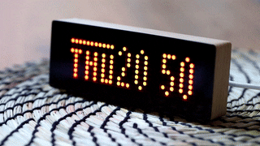
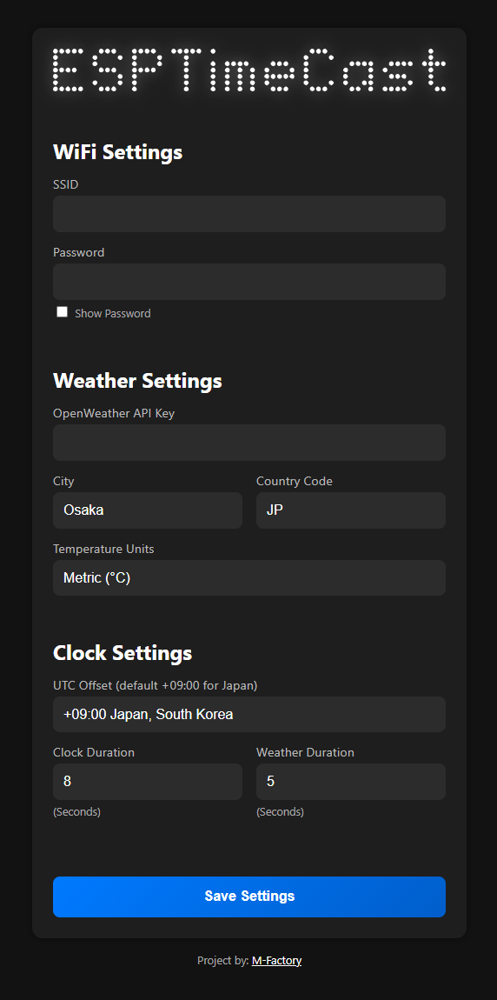

**ESPTimeCast** is a WiFi-connected LED matrix clock and weather station using ESP8266 and MAX7219.  
It shows the current time and day of the week, syncs via NTP, and fetches weather data every 5 minutes from OpenWeatherMap.

 
---

## ✨ Features

* LED matrix display (8x32) powered by MAX7219
* WiFi configuration via web interface
* Real-time clock via NTP, current day of the week
* Current temperature display from OpenWeatherMap
* Fallback AP mode for first-time setup

---

## 🪛 Wiring Diagram

Connect the Wemos D1 Mini (ESP8266) to MAX7219 as follows:

| Wemos D1 Mini | MAX7219 |
| ------------- | ------- |
| GND           | GND     |
| D6            | CLK     |
| D7            | CS      |
| D8            | DIN     |
| 3V3           | VCC     |

---

## 🌐 Web Interface

The device hosts a built-in web interface for configuration.

1. On first boot, connect to the fallback AP:
   * **SSID**: `ESPTimeCast`
   * **Password**: `12345678`
   * Open `http://192.168.4.1` in your browser
2. Enter your home Wifi and Password settings
3. Weather settings: Enter your OpenWeatherMap API, City and Country Code
4. Clock settings: Select your UTC Offset from the dropdown menu (default is `+09:00` for Japan)
5. Configure Clock and Weather display duration (in seconds)
6. Save your settings (device will reboot)

### UI Preview:

---

## ⚙️ Configuration Notes

* **OpenWeatherMap API Key**: Get one at [openweathermap.org](https://openweathermap.org/api)
* **City Name**: Use city names like `Tokyo`, `London`, etc.
* **Country Code**: Enter the 2-letter country code (e.g., JP for Japan, GB for United Kingdom).
* **UTC Offset**: Select an offset from the dropdown menu.

---

## 🔧 Installation

1. Clone this repo
2. Flash the code using **Arduino IDE** or **PlatformIO**
3. Upload the `/data` folder using **LittleFS uploader**

### 🔧 Board Setup

Install the ESP8266 board package in Arduino IDE:  
**Additional Board Manager URL**:  
http://arduino.esp8266.com/stable/package_esp8266com_index.json

### 📦 Dependencies

Make sure the following libraries are installed via the Arduino Library Manager or PlatformIO:

* `NTPClient` by Fabrice Weinberg
* `ArduinoJson` by Benoit Blanchon
* `MD_Parola` / `MD_MAX72xx` all dependencies by majicDesigns
* `ESPAsyncTCP` by ESP32Async
* `ESPAsyncWebServer` by ESP32Async

### 📁 LittleFS Upload

Use the **LittleFS Uploader Plugin** (install manually):  
👉 [Installation Guide](https://randomnerdtutorials.com/arduino-ide-2-install-esp8266-littlefs/)

To upload the `/data` folder:

1. Open the Command Palette:
   * Windows: `Ctrl + Shift + P`
   * macOS: `Cmd + Shift + P`
2. Run: `Upload LittleFS to Pico/ESP8266/ESP32`

**Important:** Make sure the Serial Monitor is **closed** before uploading.

---

## 🤝 Contributing

Pull requests are welcome! For major changes or bugs, please open an issue first to discuss what you'd like to improve or add.

---

## ☕ Support This Project

If you like this project, feel free to support me via [PayPal](https://paypal.me/officialuphoto).
