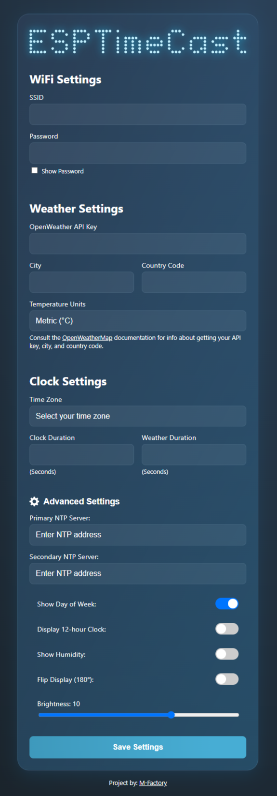

# ESPTimeCast (forked)

My fork is based on PlatformIO.

**ESPTimeCast** is a WiFi-connected LED matrix clock and weather station based on ESP8266 and MAX7219.  
It displays the current time, day of the week (with custom symbols), and local weather (temp/humidity) fetched from OpenWeatherMap.  
Setup and configuration are fully managed via a built-in web interface.  

3D Printable case available at [3D Printable Case on Cults3D](https://cults3d.com/en/3d-model/gadget/wifi-connected-led-matrix-clock-and-weather-station-esp8266-and-max7219)

---

## ✨ Features

- **LED Matrix Display (8x32)** powered by MAX7219, with custom font support
- **Simple Web Interface** for all configuration (WiFi, weather, time zone, display durations, and more)
- **Automatic NTP Sync** with robust status feedback and retries
- **Day of Week Display** with custom icons/symbols
- **Weather Fetching** from OpenWeatherMap (every 5 minutes, temp/humidity)
- **Temperature Unit Selector** (`C`, `F`, or `K` displays in temp mode only)
- **Fallback AP Mode** for easy first-time setup or WiFi recovery, with `/ap_status` endpoint
- **Timezone Selection** from IANA names (DST integrated on backend)
- **Persistent Config** stored in LittleFS, with backup/restore system
- **Status Animations** for WiFi conection, AP mode, time syncing.
- **Advanced Settings** panel with:
  - Custom **Primary/Secondary NTP server** input
  - Display **Day of the Week** toggle (defualt in on)
  - **24/12h clock mode** toggle (24-hour default)
  - Show **Humidity** toggle (display Humidity besides Temperature)
  - **Flip display** (180 degrees)
  - Adjustable display **brightness**

---

## 🪛 Wiring

### Wemos D1 Mini (ESP8266) → MAX7219

| Wemos D1 Mini | MAX7219 |
|:-------------:|:-------:|
| GND           | GND     |
| D6            | CLK     |
| D7            | CS      |
| D8            | DIN     |
| 3V3           | VCC     |

---

## 🌐 Web UI & Configuration

The built-in web interface provides full configuration for:

- **WiFi settings** (SSID & Password)
- **Weather settings** (OpenWeatherMap API key, City, Country, Units)
- **Time zone** (will auto-populate if TZ is found)
- **Display durations** for clock and weather (milliseconds)
- **Advanced Settings** (see below)

### First-time Setup / AP Mode

1. Power on the device. If WiFi fails, it auto-starts in AP mode:
   - **SSID:** `ESPTimeCast`
   - **Password:** `12345678`
   - Open `http://192.168.4.1` in your browser.
2. Set your WiFi and all other options.
3. Click **Save Setting** – the device saves config, reboots, and connects.

### UI Example

---

## ⚙️ Advanced Settings

Click the **cog icon** next to “Advanced Settings” in the web UI to reveal extra configuration options.  

**Available advanced settings:**

- **Primary NTP Server**: Override the default NTP server (e.g. `pool.ntp.org`)
- **Secondary NTP Server**: Fallback NTP server (e.g. `time.nist.gov`)
- **Day of the Week**: Display symbol for Day of the Week
- **24/12h Clock**: Switch between 24-hour and 12-hour time formats (24-hour default)
- **Humidity**: Display Humidity besides Temperature
- **Flip Display**: Invert the display vertically/horizontally
- **Brightness**: 0 (dim) to 15 (bright)

*Tip: Changing these options takes effect after saving and rebooting.*

---

## 📝 Configuration Notes

- **OpenWeatherMap API Key:** [Get yours here](https://openweathermap.org/api)
- **City Name:** e.g. `Tokyo`, `London`, etc.
- **Country Code:** 2-letter code (e.g., `JP`, `GB`)
- **Time Zone:** Select from IANA zones (e.g., `America/New_York`, handles DST automatically)
- **Units:** `metric` (°C), `imperial` (°F), or `standard` (K)

---

## 🔧 Installation

1. **Clone this repo**
2. **Flash the ESP8266** using Arduino IDE or PlatformIO
3. **Upload `/data` folder** with LittleFS uploader (see below)

### Board Setup

- Install ESP8266 board package:  
  `http://arduino.esp8266.com/stable/package_esp8266com_index.json`
- Select **Wemos D1 Mini** (or your ESP8266 variant) in Tools → Board

### Dependencies

Install these libraries (Library Manager / PlatformIO):

- `ArduinoJson` by Benoit Blanchon
- `MD_Parola / MD_MAX72xx` all dependencies by majicDesigns
- `ESPAsyncTCP` by ESP32Async
- `ESPAsyncWebServer` by ESP32Async

### LittleFS Upload

Install the [LittleFS Uploader](https://randomnerdtutorials.com/arduino-ide-2-install-esp8266-littlefs/).

**To upload `/data`:**

1. Open Command Palette:
   - Windows: `Ctrl+Shift+P`
   - macOS: `Cmd+Shift+P`
2. Run: `Upload LittleFS to ESP8266`

**Important:** Serial Monitor **must be closed** before uploading!

---

## 📺 Display Behavior

**ESPTimeCast** automatically switches between two display modes: Clock and Weather.  
What you see on the LED matrix depends on whether the device has successfully fetched the current time (via NTP) and weather (via OpenWeatherMap).  
The following table summarizes what will appear on the display in each scenario:

| Display Mode | 🕒 NTP Time | 🌦️ Weather Data | 📺 Display Output                              |
|:------------:|:----------:|:--------------:|:--------------------------------------------|
| **Clock**    | ✅ Yes      | —              | 🗓️ Day Icon + ⏰ Time (e.g. `@ 14:53`)           |
| **Clock**    | ❌ No       | —              |  `no ntp` (NTP sync failed)               |
| **Weather**  | —          | ✅ Yes         | 🌡️ Temperature (e.g. `23ºC`)                |
| **Weather**  | ✅ Yes      | ❌ No          | 🗓️ Day Icon + ⏰ Time (e.g. `@ 14:53`)           |
| **Weather**  | ❌ No       | ❌ No          |  `no temp` (no weather or time data)       |

### **How it works:**

- The display automatically alternates between **Clock** and **Weather** modes (the duration for each is configurable).
- In **Clock** mode, if NTP time is available, you’ll see the current time plus a unique day-of-week icon. If NTP is not available, you'll see `no ntp`.
- In **Weather** mode, if weather is available, you’ll see the temperature (like `23ºC`). If weather is not available but time is, it falls back to showing the clock. If neither is available, you’ll see `no temp`.
- All status/error messages (`no ntp`, `no temp`) are shown exactly as written.

**Legend:**

- 🗓️ **Day Icon**: Custom symbol for day of week (`@`, `=`, etc.)
- ⏰ **Time**: Current time (HH:MM)
- 🌡️ **Temperature**: Weather from OpenWeatherMap
- ✅ **Yes**: Data available
- ❌ **No**: Data not available
- — : Value does not affect this mode

---

## 🤝 Contributing

Pull requests are welcome! For major changes, please open an issue first to discuss.

---

## ☕ Support this project

If you like this project, you can [buy me a coffee](https://paypal.me/officialuphoto)!
